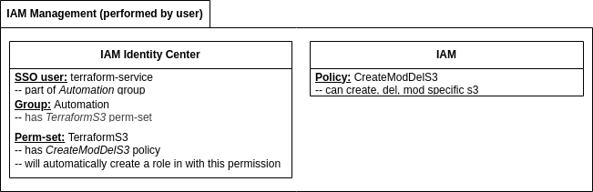

# Aim of this project
Make use of my newly gained IaC and cloud knowledge by automating the creation of an AWS infrastructure to host my Angular portfolio (currently hosted on github pages). This will not only allow me to gain hands on experience with Terraform, but AWS as well, as access policies and other configuration of AWS resources will need to be written and tested.  
  
The main repo for this project will remain private until completion, as I am experimenting with access policies, roles, credentials and other sensitive information. Once completed, any sensitive information that remains wil be removed and the rest of the project will be re-uploaded here.  
  
However, this README will be updated regularly, as new steps are completed, in order to publically log my progress and document my challenges.  

# Initial planification
## Infrastructure
- Set up AWS credentials for Terraform (IAM user & role with appropriate policies)  
- Configure Terraform to use those credentials  
- Use Terraform to deploy a single s3 bucket on AWS with the appropriate policy  

## Deployment 
- Use Terraform to clone the portfolio from github into s3 bucket
- Use Terraform to build and deploy the website within the s3 bucket  

## Redirection
- Acquire a domain/subdomain name
- Use Terraform and Amazon Route 53 to redirect the s3 bucket link to the custom domain  

# Development log
## Granting Terraform access to AWS resources (completed)
- Determined that creating a user specifically for Terraform and using its access keys involves long-term credentials (not ideal). SSO session preferrable.  
- Configured SSO provider.
- Created appropriate user, group and permission set (SSO provider will automatically generate a role according to the permission set once attributed to an account).
- Configured SSO profile for this particular project.
- Created bash script to login by sso and retrieve **_temporary_** credentials and exported them as environment vars.
- Used credentials to run terraform script to create private s3 bucket.
- Logged out from SSO session and unset all environment variables (still within bash script).
- This ensures that no permanent credentials or permissions are given to external services, or stored locally.
  
### Final structure of IAM mgmt
  

### Final workflow of bash script retrieving credentials (completed)
1. SSO login with desired role specified (specifically, the one created by IAM Identity center when the perm-set was assigned to an account)
2. Access token extraction from cached sso profile using sha1sum of profile name
3. Temporary credentials for role retrieved using `get-role-credentials` 
4. Credentials exported to env using aws credentials variable names recognizeable by tf  (var names typically found in aws/credentials file)
5. Terraform script executed using these credentials
6. Temporary credentials cleared
7. SSO session terminated  
      
## Creating Terraform script to deploy portfolio bucket (in progress)
- Specify region in provider (credentials already exported to env, no need to include them in tf script as tf will retrieve them itself)
- Specify bucket name
- Specify private acl to ensure s3 bucket remains private
- Left to do: clone portfolio repo into bucket (Ansible?)

## Making the portfolio available through CloudFront (not started)
- Under construction.
